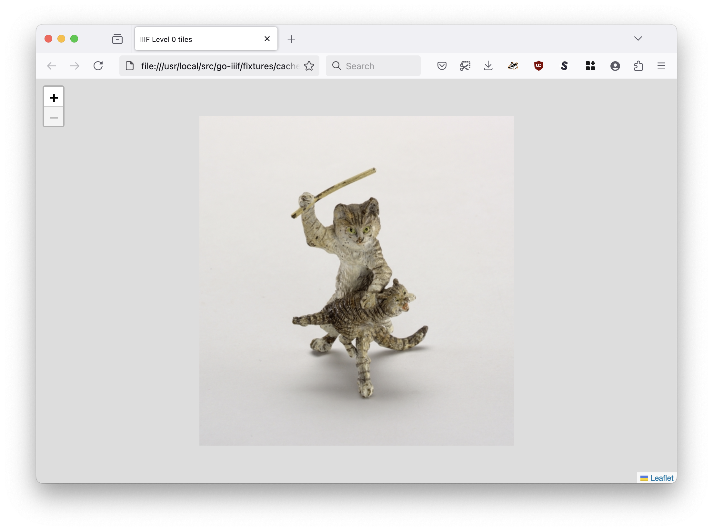
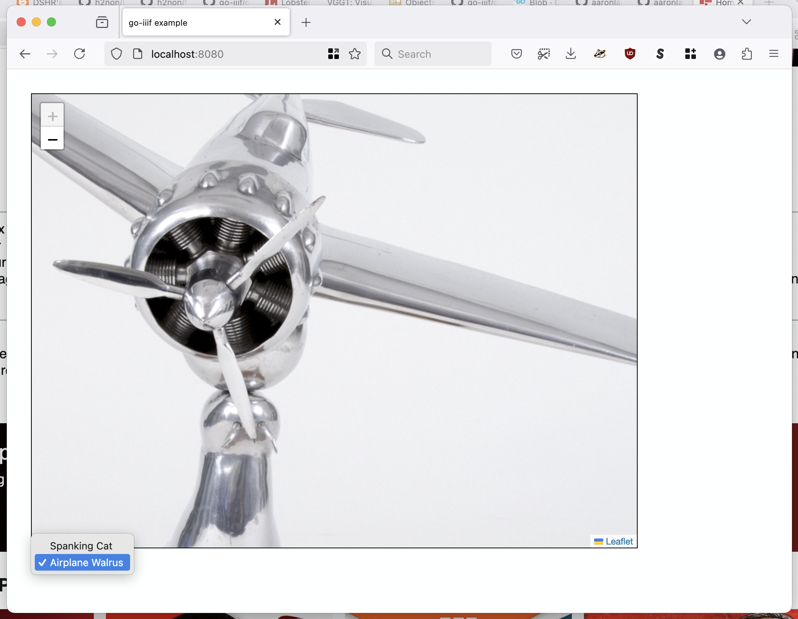

# go-iiif


## Motivation

This began as a fork of [@greut's iiif](https://github.com/greut/iiif) package that moves all of the processing logic for the [IIIF Image API](http://iiif.io/api/image/) in to discrete Go packages and defines source, derivative and graphics details in a [JSON config file](README.md#config-files). There is an additional caching layer for both source images and derivatives.

I did this to better understand the architecture behind (and to address my own concerns about) the [IIIF Image API](http://iiif.io/api/image/2.1/index.html). For the time being this package will probably not support the other IIIF Metadata or Publication APIs.

_And by "forked" I mean that [@greut](https://github.com/greut) and I decided that [it was best](https://github.com/greut/iiif/pull/2) for this code and his code to wave at each other across the divide but not necessarily to hold hands._

## Releases

The current release is `github.com/go-iiif/go-iiif/v7`.

Documentation for releases has been moved in to [RELEASES.md](RELEASES.md).

## Command-line tools

_Note: command-line tools and utilities are included at the top of this document to accomodate the busy and/or curious. There are a number of important concepts to understand in how the `go-iiif` package is used (in particular config files) which are discussed in detail below._

### Building

Run the handy `cli` Makefile target to build all the tools:

```
$> make cli
go build -mod vendor -ldflags="-s -w" -o bin/iiif-transform cmd/iiif-transform/main.go
go build -mod vendor -ldflags="-s -w" -o bin/iiif-tile-seed cmd/iiif-tile-seed/main.go
go build -mod vendor -ldflags="-s -w" -o bin/iiif-process cmd/iiif-process/main.go
go build -mod vendor -ldflags="-s -w" -o bin/iiif-server cmd/iiif-server/main.go
go build -mod vendor -ldflags="-s -w" -o bin/iiif-dump-config cmd/iiif-dump-config/main.go
```

### Config files

Detailed documentation for config files has been moved in to [config/README.md](config/README.md].

In the interest of trying to keep simple things simple all of the command line tools use a default configuration file, indicated by the URI `default://` which is defined in the [defaults/config.json](defaults/config.json) file. The default configuration looks and writes source and cache images, respectively, to an in-memory provider. As such, until you define at least an alternative source location (or your own config file) the tools won't _do_ very much.

Custom source and cache locations are defined as fully-qualified URIs mapped to implementations of the `Source` and `Cache` interfaces (discussed below). For example to define a custom on-disk location for reading source images you would do this:

```
	-config-images-source-uri file:///usr/local/src/go-iiif/fixtures/images
```

And to define a custom on-disk location to write (cache) derivate image files you would do this:

```
	-config-derivatives-cache-uri file:///usr/local/src/go-iiif/fixtures/cache
```

### iiif-transform

Transform one or more images using the IIIF API. For detailed usage consult [cmd/iiif-transform/README.md](cmd/iiif-transform/README.md)

### iiif-tile-seed

For detailed usage consult [cmd/iiif-tile-seed/README.md](cmd/iiif-tile-seed/README.md)

_[Example provided below.](#generating-level-0-tiles)_

### iiif-process

Generate IIIF Level-0 image tiles for one or images. For detailed usage consult [cmd/iiif-process/README.md](cmd/iiif-proces/README.md)

_[Example provided below.](#generating-derivatives-using-an-instructions-file)_

### iiif-server

Expose the IIIF Image API via an HTTP endpoint. For detailed usage consult [cmd/iiif-server/README.md](cmd/iiif-server/README.md)

_[Example provided below.](#running-a-iiif-api-endpoint)_

### iiif-dump-config

Emit a go-iiif config file as Markdown. For detailed usage consult [cmd/iiif-dump-config/README.md](cmd/iiif-dump-config/README.md)

### Examples

The easiest way to try things out is to use the handy `debug-{SOMETHING}` Makefile targets which will perform operations on files bundled with this package (in the [fixtures](fixtures) directory).

#### Generating IIIF Level 0 tiles (debug-seed)

Generate IIIF Level 0 tiles for the [fixtures/spanking-cat.jpg](fixtures/spanking-cat.jpg) image and store those tiles in a folder named `spank`.

```
$> make debug-seed
if test -d /usr/local/src/go-iiif/fixtures/cache/spank; then rm -rf /usr/local/src/go-iiif/fixtures/cache/spank; fi
go run cmd/iiif-tile-seed/main.go \
		-config-images-source-uri file:///usr/local/src/go-iiif/fixtures/images \
		-config-derivatives-cache-uri file:///usr/local/src/go-iiif/fixtures/cache \
		-verbose \
		-generate-html \
		'rewrite:///spanking-cat.jpg?target=spank'
2025/03/24 17:55:42 DEBUG Verbose logging enabled
2025/03/24 17:55:42 DEBUG New tiled image origin=spanking-cat.jpg target=spank

... time passes, with lots of debugging information

2025/03/24 17:56:08 DEBUG Tile seeding complete source=spanking-cat.jpg target=spank count=340
2025/03/24 17:56:08 INFO Generate HTML index page for tiles source=spanking-cat.jpg alt=spank
2025/03/24 17:56:08 DEBUG Successfully wrote blob "bucket uri"=file:///usr/local/src/go-iiif/fixtures/cache uri=spank/leaflet.iiif.bundle.js
2025/03/24 17:56:08 DEBUG Successfully wrote blob "bucket uri"=file:///usr/local/src/go-iiif/fixtures/cache uri=spank/leaflet.css
2025/03/24 17:56:08 DEBUG Successfully wrote blob "bucket uri"=file:///usr/local/src/go-iiif/fixtures/cache uri=spank/index.html
2025/03/24 17:56:08 DEBUG Time to seed tiles source=spanking-cat.jpg target=spank time=25.699858709s
```

And then because the `-generate-html` flag was specified you can do this:

```
$> open fixtures/cache/spank/index.html
```

And see something like this in your web browser:



The folder containing the IIIF Level 0 tiles also contains just enough HTML and JavaScript code to show those tiles in a traditional "zoomable image" interface. These views are disabled by default and are mostly meant for reviewing the output of the seeding operation. For a more sophiticated "zoomable image" interface see the [sfomuseum/webcomponent-zoomable-image](https://github.com/sfomuseum/webcomponent-zoomable-image) package.

#### Generating Level 0 tiles from a CSV file (debug-seed-csv)

Generate a CSV file containing information about images in the [fixtures](fixtures) folder and then generate Level 0 tiles for each image in the CSV file.

```
$> make debug-seed-csv
if test -d /usr/local/src/go-iiif/fixtures/cache/spanking-csv; then rm -rf /usr/local/src/go-iiif/fixtures/cache/spanking-csv; fi
if test -d /usr/local/src/go-iiif/fixtures/cache/walrus-csv; then rm -rf /usr/local/src/go-iiif/fixtures/cache/walrus-csv; fi
if test -f /usr/local/src/go-iiif/fixtures/seed.csv; then /usr/local/src/go-iiif/fixtures/seed.csv; fi

echo "source_filename,source_root,target_filename,target_root" > /usr/local/src/go-iiif/fixtures/seed.csv
echo "spanking-cat.jpg,/usr/local/src/go-iiif/fixtures/images,spanking-csv,/usr/local/src/go-iiif/fixtures/cache" >> /usr/local/src/go-iiif/fixtures/seed.csv
echo "walrus.jpg,/usr/local/src/go-iiif/fixtures/images,walrus-csv,/usr/local/src/go-iiif/fixtures/cache" >> /usr/local/src/go-iiif/fixtures/seed.csv

go run cmd/iiif-tile-seed/main.go \
		-mode csv \
		-generate-html \
		-verbose \
		/usr/local/src/go-iiif/fixtures/seed.csv
		
2025/03/25 14:39:51 DEBUG Verbose logging enabled
2025/03/25 14:39:51 INFO Assign new source URI path=/usr/local/src/go-iiif/fixtures/seed.csv uri=file:///usr/local/src/go-iiif/fixtures/images
2025/03/25 14:39:51 INFO Assign new cache URI path=/usr/local/src/go-iiif/fixtures/seed.csv uri=file:///usr/local/src/go-iiif/fixtures/cache
2025/03/25 14:39:51 INFO Seed tiles path=/usr/local/src/go-iiif/fixtures/seed.csv source=spanking-cat.jpg target=spanking-csv
2025/03/25 14:39:51 DEBUG Tile waiting to seed source=spanking-cat.jpg time=1.338917ms
2025/03/25 14:39:51 INFO Assign new source URI path=/usr/local/src/go-iiif/fixtures/seed.csv uri=file:///usr/local/src/go-iiif/fixtures/images
2025/03/25 14:39:51 INFO Assign new cache URI path=/usr/local/src/go-iiif/fixtures/seed.csv uri=file:///usr/local/src/go-iiif/fixtures/cache
2025/03/25 14:39:51 INFO Seed tiles path=/usr/local/src/go-iiif/fixtures/seed.csv source=walrus.jpg target=walrus-csv
2025/03/25 14:39:51 INFO Seed tiles for image "source id"=spanking-cat.jpg "alt id"=spanking-csv "image cache"=memory:// "derivatives cache"=file:///usr/local/src/go-iiif/fixtures/cache processes=10 scales="[8 4 2 1]"

... time passes, with lots of debugging information
```

And then eventually:

```
$> ll fixtures/cache/*-csv/info.json
-rw-r--r--  1 asc  staff  336 Mar 25 14:40 fixtures/cache/spanking-csv/info.json
-rw-r--r--  1 asc  staff  334 Mar 25 14:39 fixtures/cache/walrus-csv/info.json
```

_Note the way we passed the `-generate-html` flag like we did in the first example ensuring that each set of tiles has its own HTML "zoomable image" representation._

Please make sure to consult the [usage documentation](cmd/iiif-tile-seed/README.md#csv-input) for the `iiif-tile-seed` tool for details on how CSV files should be structured.

#### Generating named (labeled) derivatives using an "instructions" file (debug-process)

Generate a series of named (labeled) derivatives images for the [fixtures/spanking-cat.jpg](fixtures/spanking-cat.jpg) image from an "instructions" file, storing each derivative in a nested tree.

```
$> make debug-process
if test -d /usr/local/src/go-iiif/fixtures/cache/999; then rm -rf /usr/local/src/go-iiif/fixtures/cache/999; fi
go run cmd/iiif-process/main.go \
		-config-derivatives-cache-uri file:///usr/local/src/go-iiif/fixtures/cache \
		-config-images-source-uri file:///usr/local/src/go-iiif/fixtures/images \
		-report \
		-report-bucket-uri file:///usr/local/src/go-iiif/fixtures/reports \
		-report-html \
		-verbose \
		'idsecret:///spanking-cat.jpg?id=9998&secret=abc&secret_o=def&format=jpg&label=x'
2025/03/24 17:57:13 DEBUG Verbose logging enabled

... time passes, with lots of debugging information

2025/03/24 17:57:17 DEBUG Successfully wrote blob "bucket uri"=file:///usr/local/src/go-iiif/fixtures/cache uri=999/8/9998_abc_k.jpg
2025/03/24 17:57:17 DEBUG Return transformation uri="rewrite:///spanking-cat.jpg?target=999%2F8%2F9998_abc_k.jpg" origin=spanking-cat.jpg target=999/8/9998_abc_k.jpg "source cache"=memory:// "destination cache"=file:///usr/local/src/go-iiif/fixtures/cache "new uri"=file:///999/8/9998_abc_k.jpg
2025/03/24 17:57:17 DEBUG Successfully wrote blob "bucket uri"=file:///usr/local/src/go-iiif/fixtures/cache uri=999/8/index.html
```

And then because the `-report-html` flag was specified you can do this:

```
$> open fixtures/cache/999/8/index.html
```

And see something like this in your web browser:


The folder contained the "processed" derivative images also contains a simple HTML file displaying each of the derivative images. These views are disabled by default and are mostly for reviewing the output of the process(ing) operation.

Please make sure to consult the [usage documentation](cmd/iiif-proces/README.md) for the `iiif-process` tool for details on "instructions" and "reports".

#### Running a IIIF API (HTTP) endpoint (debug-server)

Run a IIIF API endpoint (server).

```
$> make debug-server
mkdir -p fixtures/cache
go run cmd/iiif-server/main.go \
		-config-derivatives-cache-uri file:///usr/local/src/go-iiif/fixtures/cache \
		-config-images-source-uri file:///usr/local/src/go-iiif/fixtures/images \
		-example \
		-verbose
2025/03/24 17:55:18 DEBUG Verbose logging enabled
2025/03/24 17:55:18 INFO Listening for requests address=http://localhost:8080
```

And then, because the `-example` flag was specified, when you open your web browser to `http://localhost:8080` you'll see this:



The "example" handler provides just enough HTML and JavaScript code to render tile images in a traditional "zoomable image" interface using the IIIF Image API endpoints. This handler is disabled by default and is mostly meant for ensuring that everything is working. For a more sophiticated "zoomable image" interface see the [sfomuseum/webcomponent-zoomable-image](https://github.com/sfomuseum/webcomponent-zoomable-image) package.

### Extending the command line tools

The "guts" of all the command line tools live in the [app](app) package. This allows the definitions for the actual command line tools to be small and easy to extend.

For example if you want to extend the `iiif-tile-seed` tool to use a custom caching layer (discussed below) not included in this package by default you'll need to clone [cmd/iiif-tile-seed/main.go](cmd/iiif-tile-seed/main.go) and then add the relevant import statement. For example:

```
package main

import (
	"context"
	"log"

	_ "github.com/aaronland/gocloud-blob/s3"
	_ "github.com/go-iiif/go-iiif/v7/native"
	_ "gocloud.dev/blob/fileblob"
	_ "gocloud.dev/blob/memblob"
	_ "gocloud.dev/blob/s3blob"	
        _ "yourprovider.host/go-iiif-cache"	// YOUR CUSTOM CODE
       
	"github.com/go-iiif/go-iiif/v7/app/seed"
)

func main() {

	ctx := context.Background()
	err := seed.Run(ctx)

	if err != nil {
		log.Fatal(err)
	}
}
```

Which is not ideal but is at least short and sweet and easy.

## Drivers

`go-iiif` was first written with the [libvips](https://github.com/jcupitt/libvips) library and [bimg](https://github.com/h2non/bimg/) Go wrapper for image processing. `libvips` is pretty great but it introduces non-trivial build and setup requirements. As of version 2.0 `go-iiif` no longer uses `libvips` by default but instead does all its image processing using native (Go) code. This allows `go-iiif` to run on any platform supported by Go without the need for external dependencies.

Detailed documentation for drivers has been moved in to [driver/README.md](driver/README.md])

## Data sources

Data sources in `go-iiif` are not so much "complicated" as they are "nuanced". By default IIIF assumes that everything is on a local disk (or "mount") and that everything references the canonical filename of an image. There is nothing wrong with these assumptions but they don't always reflect the reality of how data is organized or meant to be exposed.

As such, `go-iiif` makes use of the following constructs when working with data sources:

### Image and cache "sources"

The first are the `Source` and `Cache` interfaces. These define common (Go language) interfaces for data sources (images) and any caching layers necessary for working with those images or the derivative products produced by the IIIF Image API.

The `Source` interface looks like this:

```
// Source is an interface representing a primary image source.
type Source interface {
	// Read returns the body of the file located at 'uri'.
	Read(uri string) ([]byte, error)
	// Close performs any final operations specific to a data source.
	Close() error
}
```

The `Cache` interface looks like this:

```
// A Cache is a representation of a cache provider.
type Cache interface {
	// Exists returns a boolean value indicating whether a key exists in the cache.
	Exists(string) bool
	// Get returns the value for a specific key in the cache.
	Get(string) ([]byte, error)
	// Set assigns the value for a specific key in the cache.
	Set(string, []byte) error
	// Unset removes a specific key from the cache.
	Unset(string) error
	// Close performs any final operations specific to a cache provider.	
	Close() error
}
```

This package provides the following default implementations for both interfaces:

* Any registered [Go Cloud](https://gocloud.dev/) `Bucket` source (for example: files, in-memory, S3 or other cloud providers). See [source/blob.go](source/blob.go) and [cache/blob.go](cache/blob.go) for details.

#### Default source implementations

This package also provides the following default implementations for the `Source` interface:

* A source provider to yield images using the Flickr API. See [source/flickr.go](source/flickr.go) for details.
* A source provider to yield images using a custom URI template. See [source/uritemplate.go](source/uritemplate.go) for details.

#### Default cache implementations

This package also provides the following default implementations for the `Cache` interface:

* In-memory key-value storage. See [cache/blob.go](cache/blob.go) for details.

#### Custom implementations

To define custom source or cache implementations you need to do two things:

1. Implement all the relevant interface methods
2. "Register" a interface-implementation callback method using the `RegisterCache` (or `RegisterSource`) method.

For example, here is how you might implement a custom cache implementation:

```
import (
       "context"

       iiifcache "github.com/go-iiif/go-iiif/v7/cache"
)

type CustomCache struct {
	Cache
	// your details here
}

func init() {
     iiiicache.RegisterCache(context.Background(), "custom", NewCusomCache)
}

func NewCusomCache(ctx context.Context, uri string) (Cache, error) {
	c := CustomCache{}
	return &c, nil
}

// Cache interface methods here
```

And then in your code you would import your custom package like this:

```
import (
       _ "yourprovider.host/go-iiif-cache"
)
```

And in your config file you would do something like this:

```
    "derivatives": {
	"cache": { "uri": "custom://?{YOUR_CUSTOM_PARAMETERS}" }	
    }        
```

### "Buckets"

Starting with version 2 the `go-iiif` package uses the [Go Cloud](https://gocloud.dev/) `Bucket` and `Blob` interfaces for reading and writing all files. For example, instead of doing this:

```
cfg, _ := config.NewConfigFromFile("/etc/go-iiif/config.json")
```

It is now necessary to do this:

```
config_bucket, _ := bucket.OpenBucket(ctx, "file:///etc/go-iiif")
cfg, _ := config.NewConfigFromBucket(ctx, config_bucket, "config.json")
```
This allows for configuration files, and others, to be stored and retrieved from [any "bucket" source that is supported by the Go Cloud package](https://gocloud.dev/howto/blob/#services), notably remote storage services like AWS S3.

### "URIs"

_[go-iiif-uri](https://github.com/go-iiif/go-iiif-uri) URI strings are technically still a "work in progress" but since they haven't meaningfully changed in a few years they are probably close to being considered stable._

`go-iiif-uri` URI strings are defined by a named scheme which indicates how an URI should be processed, a path which is a reference to an image and zero or more query parameters which are the specific instructions for processing the URI.

### file

```
file:///path/to/source/image.jpg
```

```
file:///path/to/source/image.jpg?target=/path/to/target/image.jpg
```

The `file://` URI scheme is basically just a path or filename. It has an option `target` property which allows the name of the source image to be changed. These filenames are _not_ the final name of the image as processed by `go-iiif` but the name of the directory structure that files will be written to, as in the weird IIIF instructions-based URIs. 

Valid parameters for the `file://` URI scheme are:

| Name | Type | Required |
| --- | --- | --- |
| target | string | no |

### idsecret

```
idsecret:///path/to/source/image.jpg?id=1234&secret=s33kret&secret_o=seekr3t&label
```

The `idsecret://` URI scheme is designed to rewrite a source image URI to {UNIQUE_ID} + {SECRET} + {LABEL} style filenames. For example `cat.jpg` becomes `1234_s33kret_b.jpg` and specifically `123/4/1234_s33kret_b.jpg` where the unique ID is used to generate a nested directory tree in which the final image lives.

The `idsecret://` URI scheme was developed for use with `go-iiif` "instructions" files where a single image produced multiple derivatives that need to share commonalities in their final URIs.

Valid parameters for the `idsecret://` URI scheme are:

| Name | Type | Required |
| --- | --- | --- |
| id | int64 | yes |
| label | string | yes |
| format | string | yes |
| original | string | no |
| secret | string | no |
| secret_o | string | no |

If either the `secret` or `secret_o` parameters are absent they will be auto-generated.

### rewrite

```
rewrite:///path/to/source/image.jpg?target=/path/to/target/picture.jpg
```

The `rewrite://` URI scheme is a variant of the `file://` URI scheme except that the `target` query parameter is required and it will be used to redefine the final URI, rather than just its directory tree, of the processed image.

| Name | Type | Required |
| --- | --- | --- |
| target | string | yes |

### Example

Here's a excerpted example taken from the [process/parallel.go](process/parallel.go) package that processes a single source image, defined as an `idsecret://` URI, in to multiple derivatives defined in an "instructions" file.

The `idsecret://` URI is output as a string using the instructions set to define the `label` and other query parameters. That string is then used to create a new `rewrite://` URI where source is derived from the original `idsecret://` URI and the target is newly generate URI string.

```
go func(ctx context.Context, u iiifuri.URI, label Label, i IIIFInstructions) {

	var process_uri iiifuri.URI

	switch u.Driver() {
	case "idsecret":

		str_label := fmt.Sprintf("%s", label)

		opts := &url.Values{}
		opts.Set("label", str_label)
		opts.Set("format", i.Format)

		if str_label == "o" {
			opts.Set("original", "1")
		}

		target_str, _ := u.Target(opts)

		origin := u.Origin()

		rw_str := fmt.Sprintf("%s?target=%s", origin, target_str)
		rw_str = iiifuri.NewRewriteURIString(rw_str)

		rw_uri, err := iiifuri.NewURI(rw_str)
		process_uri = rw_uri

	default:
		process_uri = u
	}

	new_uri, im, _ := pr.ProcessURIWithInstructions(ctx, process_uri, label, i)
	// do something with new_uri and im here...
	
}(...)
```

## Performance and load testing

For processing large, or large volumes of, images the bottlenecks will be:

* CPU usage crunching pixels
* Disk I/O writing tiles to disk
* Running out of inodes

That said on a machine with 8 CPUs and 32GB RAM I was able to run the machine hot with all the CPUs pegged at 100% usage and seed 100, 000 (2048x pixel) images yielding a little over 3 million, or approximately 70GB of, tiles in 24 hours. Some meaningful but not overwhelming amount of time was spent fetching source images across the network so presumably things would be faster reading from a local filesystem.

Memory usage across all the `iiif-tile-seed` processes never went above 5GB and, in the end, I ran out of inodes.

The current strategy for seeding tiles may also be directly responsible for some of the bottlenecks. Specifically, when processing large volumes of images (defined in a CSV file) the `ifff-tile-seed` will spawn and queue as many concurrent Go routines as there are CPUs. For each of those processes then another (n) CPUs * 2 subprocesses will be spawned to generate tiles. Maybe this is just too image concurrent image processing routines to have? I mean it works but still... Or maybe it's just that every one is waiting for bytes to be written to disk. Or all of the above. I'm not sure yet.

## Bugs?

Probably. Please consult [the currently known-known issues](https://github.com/go-iiif/go-iiif/issues) and if you don't see what ails you please feel free to add it.

## See also

### IIIF stuff

* http://iiif.io/api/image/2.1/

### go-iiig stuff

* https://github.com/go-iiif/go-iiif-vips
* https://github.com/go-iiif/go-iiif-uri
* https://github.com/go-iiif/go-iiif-www

### Go stuff

* https://github.com/greut/iiif/
* https://github.com/anthonynsimon/bild
* https://github.com/muesli/smartcrop

### Slippy map stuff

* https://github.com/mejackreed/Leaflet-IIIF
* https://github.com/mapbox/leaflet-image

### Blog posts

* http://www.aaronland.info/weblog/2016/09/18/marshmallows/#iiif
* http://www.aaronland.info/weblog/2017/03/05/record/#numbers
* https://labs.cooperhewitt.org/2017/parting-gifts/
* https://millsfield.sfomuseum.org/blog/2018/07/18/iiif/
* https://millsfield.sfomuseum.org/blog/2019/02/12/iiif-aws/
* https://millsfield.sfomuseum.org/blog/2019/11/13/iiif-v2/

### Other stuff

* [Spanking Cat](https://collection.cooperhewitt.org/objects/18382391/)
* [Airplane Walrus](https://collection.sfomuseum.org/objects/1511908311/)