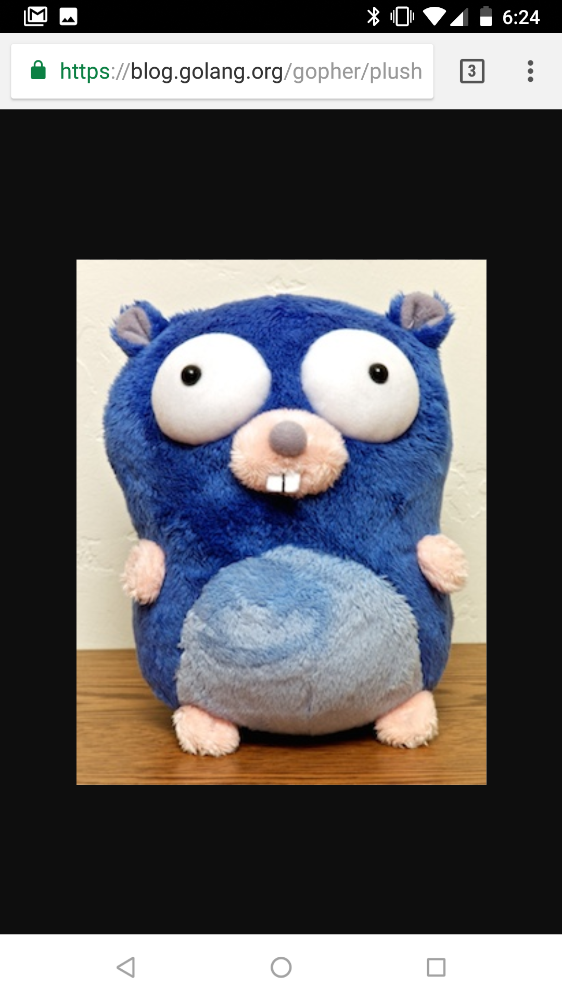
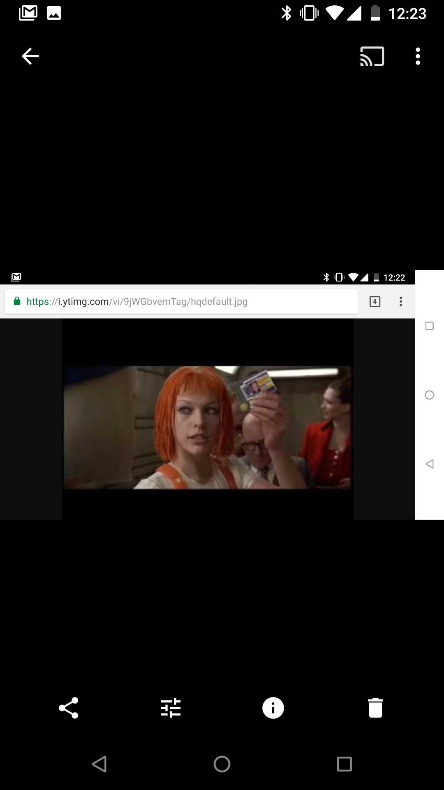
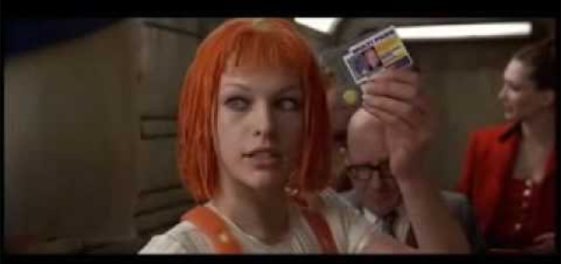
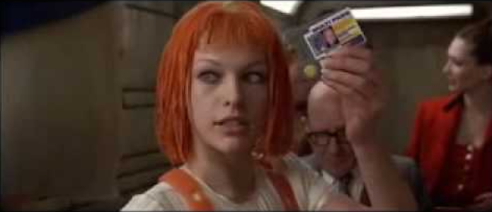

# NoBorders
### Remove borders from screenshotted images.
NoBorders is a Go library and command line tool designed to remove borders and status bars from screenshotted images. Example: 

### Before:


### Command:
```
$ noborders gopher_before.png gopher_after.png
```

### After:


It works by inspecting the entropy and variance of the 1-pixel rows and columns of an image and removing those that do not appear to be a part of the target image.

## Installation
```
go get -u github.com/neocortical/noborders
cd $GOPATH/src/github.com/neocortical/noborders/noborders
go install .
```

## Command Line Usage
```
$ noborders [options] <input_file> <output_file>
```

## Library Usage
```go
import (
    "image"

    "gihub.com/neocortical/noborders"
)

var img image.Image 

// load the image you want to crop...

// optional, can be nil
opts := noborders.Opts().
    SetEntropy(0.05).
    SetVariance(100000).
    SetMultiPass(true)
        
img, err := noborders.RemoveBorders(img, opts)
// handle errors, save output image, etc.
```

## Notes
Disclamer: I am not an image processing person. There is probably a lot of established science that would make this library better. If you know of any, please create an issue with the details. I would love to make things faster, more robust, and more selective when it comes to retaining low-entropy backgrounds like sky that are present in the target image.

Evolution: I originally wrote this with a very naive algorithm that looked at the first pixel in a row or column and elimated the row/column if all of the other pixels are similar. That worked pretty well, but it's easy to create pathological failure cases and it was also very bad at removing mobile phone status bars, browser location bars, etc. So I moved on to use row/column entropy, which is super-good at removing status bars, but often fails to get rid of areas right around the target image due to aliasing and compression artifacts. As a solution, I added a variance calculation, which when coupled with entropy seems to work out pretty well.

This library functions pretty badly when the target image is lineart. I would love to hear solutions for this. 

A note on multipass mode. The motivation here is to be able to deal with images that have been screenshotted multiple times, resulting in layers of verticle and horizontal borders. To illustrate, I took some recursive screenshots: 



Here's the output of running **noborders** with default settings. It performs better than I expected it to, but it still leaves some black border: 
```
$ noborders doc/multipass.png doc/multipass_1pass.png
```


Here's the result of using multipass mode. The remaining black border is gone: 
```
$ noborders -multipass doc/multipass.png doc/multipass_MULTIPASS.png
```


The reason why this is not the default setting is that it tends to eat into low-entropy parts of the target image.
